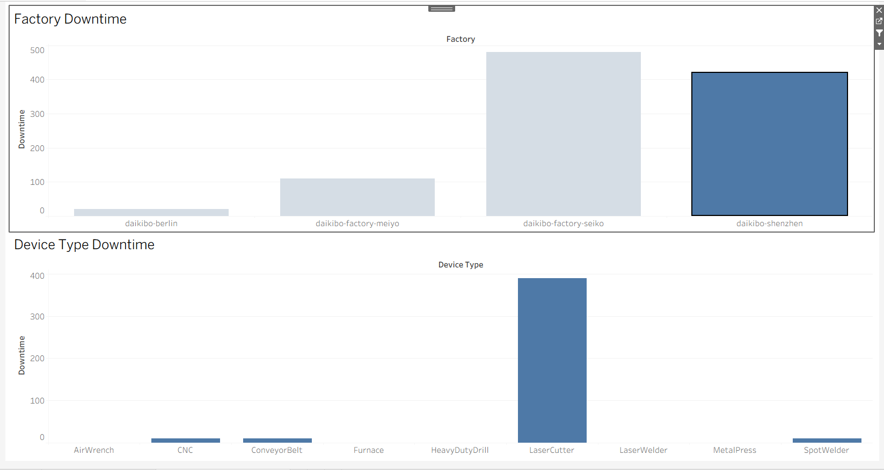

# Machine Downtime Analysis (Tableau)

##  Overview

In this project, I worked with machine telemetry data to understand downtime across different factories and device types. The goal was to take raw data and turn it into something meaningful and easy to explore.

##  What I Did

* Cleaned and explored the dataset in Tableau
* Created a calculated field to measure downtime
* Built two charts:

  * Downtime by Factory
  * Downtime by Device Type
* Combined them into an interactive dashboard where selecting a factory filters the device-level view

##  Tools Used

* Tableau (visualization, dashboarding, filters)

##  Key Takeaways

* Quickly identified which factory had the highest downtime
* Found which machine types were contributing the most
* Made it easy to drill down into specific factory-level issues

##  Dashboard Preview

##  Files

`machine-downtime-dashboard.twbx` – Tableau dashboard file  
`Dataset used for analysis` - https://drive.google.com/file/d/1L9Q1ATl9aKPtMYL5MufEeU5EXUEYywqB/view?usp=sharing [Download Here]
`dashboard.png` – Screenshot of the final dashboard 

##  Outcome

This project helped me practice turning raw operational data into a simple, interactive dashboard that highlights key problem areas and supports better decision-making.
